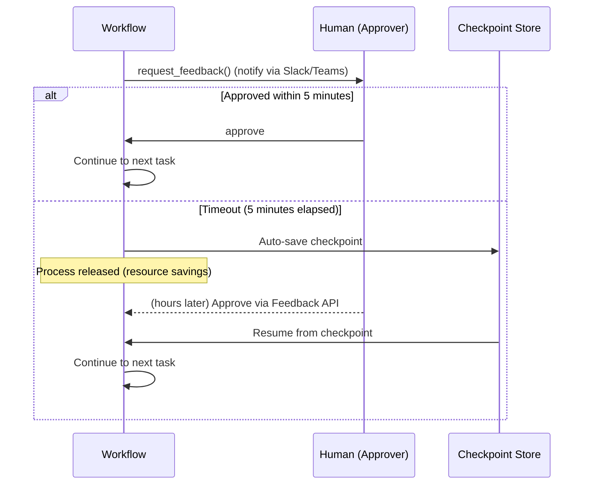

Comparing LangGraph and Graflow on production-critical features: Human-in-the-Loop, checkpoint/resume, parallel error policies, distributed execution, and task handlers.

<!-- truncate -->

This is Part 2 of our three-part comparison series. [Part 1](/blog/langgraph-vs-graflow-part1) covered design philosophy and core workflow features. [Part 3](/blog/langgraph-vs-graflow-part3) covers LLM integration, tracing, and a hands-on example.

---

## 5. Human-in-the-Loop — Timeout-Aware Resource Management

### LangGraph: interrupt — Exception-Based Control Flow

LangGraph's `interrupt()` internally **raises a `GraphInterrupt` exception** to halt graph execution. It resembles Python's `raise` / `try-except` pattern — when called mid-function, everything after it is skipped and the entire graph stops.

```python
from langgraph.types import interrupt, Command
from langgraph.checkpoint.memory import MemorySaver

def request_approval(state: State) -> dict:
    # GraphInterrupt exception is raised here, halting the function
    user_input = interrupt({
        "message": "Proceed with execution?",
        "action": state["action"],
    })
    # On first run, nothing below this line executes.
    # When resumed via Command(resume=value), interrupt() returns the value.
    return {"approved": user_input.lower() == "yes"}

memory = MemorySaver()
app = graph.compile(checkpointer=memory)

result = app.invoke(input, config)
# Resume: inject value so interrupt() returns it
app.invoke(Command(resume="yes"), config)
```

Key characteristics:

- **Implicit interruption**: `interrupt()` looks like a normal function call but actually raises an exception. The control flow break isn't obvious from reading the code.
- **Re-execution on resume**: On resume, the node function runs **from the beginning**, and `interrupt()` returns the resumed value. Side effects before `interrupt()` (API calls, DB writes, etc.) **may execute twice**. Note that this is also true for Graflow — when resuming from a checkpoint, tasks are re-executed. In both frameworks, designing tasks with **idempotency** in mind is important.
- **Checkpointer required**: `interrupt()` only works with `compile(checkpointer=...)`.

Since `GraphInterrupt` is an exception object, you can catch it with `try`/`except` — Python developers familiar with exception handling may find this intuitive. However, when combined with checkpoint + `Command(resume=...)` flows, tracking where exceptions occur, where they're caught, and what state is restored can become complex.

### Graflow: request_feedback — Explicit Waiting with Notifications

```python
@task(inject_context=True)
def request_deployment_approval(context):
    response = context.request_feedback(
        feedback_type="approval",
        prompt="Approve deployment to production?",
        timeout=300,  # wait 5 minutes
        notification_config={
            "type": "webhook",
            "url": "https://hooks.slack.com/services/XXX",
            "message": "Deployment approval needed"
        }
    )
    if response.approved:
        print("Approved")
    else:
        context.cancel_workflow("Approval denied")
```

Unlike `interrupt()`, `request_feedback()` is a **regular function call** that blocks and waits for a response — no hidden exceptions, no implicit control flow changes.

Graflow supports **two waiting modes**:

1. **Blocking (with timeout)**: Wait synchronously for the specified duration. If a response arrives within the timeout, execution continues immediately.
2. **Checkpoint + async resume**: If the timeout expires, Graflow **automatically saves a checkpoint and releases the process**. Hours later, when approval comes via the Feedback API, the workflow **resumes from the checkpoint**.



LangGraph's `interrupt` always halts graph execution and requires an external `Command(resume=)` to continue. Graflow seamlessly handles both **short synchronous waits and long asynchronous resumptions**, naturally fitting the real-world pattern of "might respond immediately, might take hours."

### Built-in Feedback API

Graflow ships with a **REST API and feedback UI** for HITL. Unlike LangGraph where you need to build the `Command(resume=)` delivery mechanism yourself, Graflow provides HTTP endpoints out of the box. Since the Feedback API is a standard HTTP interface, it's straightforward to **integrate HITL flows into your own enterprise web applications** — simply call the Feedback API from your internal approval workflow UI.

| Feedback Type | Description | Use Case |
|---|---|---|
| `approval` | Approve / Reject | Deploy approvals, critical operation confirmation |
| `text` | Free text input | Parameter input, comments |
| `selection` | Single choice | Option selection |
| `multi_selection` | Multiple choice | Multi-item selection |
| `custom` | Custom format | Domain-specific feedback |

---

## 6. Checkpoint/Resume — User-Controlled Save Points

LangGraph auto-saves checkpoints at every step. While convenient, checkpoint creation is **expensive** — serializing the entire State and writing to storage impacts workflow throughput. There's no way to control when saves happen.

Graflow lets you **explicitly save at important points only**:

```python
from graflow.core.checkpoint import CheckpointManager

@task(inject_context=True)
def train_model(context):
    for epoch in range(100):
        loss = train_one_epoch(epoch)
        if epoch % 10 == 0:
            # Save explicitly at important points
            context.checkpoint(
                path="/tmp/ml_checkpoint",
                metadata={"epoch": epoch, "loss": loss}
            )

# After failure: resume from last checkpoint
CheckpointManager.resume_from_checkpoint("/tmp/ml_checkpoint")
```

Storage targets include local filesystem (`/tmp/...`) and S3 (`s3://...`).

---

## 7. Parallel Group Error Policies

LangGraph has no built-in error handling policies for parallel execution. Graflow provides **per-group flexible error control**:

```python
from graflow.core.handlers.group_policy import (
    BestEffortGroupPolicy, AtLeastNGroupPolicy, CriticalGroupPolicy,
)
from graflow.coordination.executor import CoordinationBackend

# Some failures are OK (notifications)
(send_email | send_sms | send_slack).with_execution(
    backend=CoordinationBackend.THREADING,
    policy=BestEffortGroupPolicy()
)

# Quorum-based: 2 of 4 must succeed
(task_a | task_b | task_c | task_d).with_execution(
    backend=CoordinationBackend.THREADING,
    policy=AtLeastNGroupPolicy(min_success=2)
)

# Only critical tasks determine failure
(extract | validate | enrich).with_execution(
    backend=CoordinationBackend.THREADING,
    policy=CriticalGroupPolicy(critical_task_ids=["extract", "validate"])
)
```

| Policy | Behavior | Example |
|---|---|---|
| **Strict** (default) | All tasks must succeed | Financial transactions, data validation |
| **Best-effort** | Continue on partial success | Notifications, optional processing |
| **At-least-N** | Minimum success count | Multi-region deploys, redundant configs |
| **Critical** | Only specified tasks matter | Required + optional step mix |
| **Custom** | Inherit `GroupExecutionPolicy` | Domain-specific logic |

### Per-Task Retry (RetryPolicy)

Both frameworks support per-task retry policies with similar parameters:

```python
# LangGraph
graph.add_node("unstable_node", unstable_function,
    retry=RetryPolicy(max_attempts=3, initial_interval=1.0, backoff_factor=2.0))

# Graflow
@task(retry_policy=RetryPolicy(max_retries=3, initial_interval=1.0, backoff_factor=2.0))
def unstable_function():
    ...
```

Graflow additionally supports `jitter` (±50% randomization) and `max_interval` (upper bound cap), plus workflow-wide defaults via `ExecutionContext.create(default_max_retries=3)`.

---

## 8. Distributed Execution — Beyond the Single Process

LangGraph runs in a single process. Parallelism is limited to in-process thread parallelism. [LangGraph Platform](https://langchain-ai.github.io/langgraph/concepts/langgraph_platform/) is a workflow hosting service, not a task-level distribution engine.

Graflow ships with **Redis-based distributed workers** as standard OSS:

**Step 1: Start Redis**

```bash
docker run -p 6379:6379 redis:7.2
```

**Step 2: Start multiple workers**

```bash
python -m graflow.worker.main --worker-id worker-1 --redis-host localhost
python -m graflow.worker.main --worker-id worker-2 --redis-host localhost
python -m graflow.worker.main --worker-id worker-3 --redis-host localhost
```

**Step 3: Switch to distributed execution**

```python
# One line to switch from local to distributed
parallel = (task_a | task_b | task_c).with_execution(
    backend=CoordinationBackend.REDIS,
    backend_config={"redis_client": redis_client}
)
```

In Kubernetes, HPA can [auto-scale worker pods based on Redis queue depth](https://github.com/GraflowAI/graflow/blob/main/docs/scaling/kubernetes_autoscaling.md). The architecture is similar to Apache Airflow's Celery Executor.

---

## 9. Task Handlers

LangGraph nodes only run in-process. Graflow lets you **switch execution strategies per task**:

```python
# Default: in-process execution
@task
def simple_task():
    return "result"

# Docker container execution (GPU, dependency isolation)
@task(handler="docker", handler_kwargs={
    "image": "pytorch/pytorch:2.0-gpu",
    "gpu": True,
    "volumes": {"/data": "/workspace/data"},
})
def train_on_gpu():
    return train_model()
```

| Handler | Description | Use Case |
|---|---|---|
| `direct` | In-process (default) | General tasks |
| `docker` | Container execution | GPU processing, dependency isolation, sandboxed execution |
| Custom | Implement your own | Cloud Run, remote execution, etc. |

**Docker handler benefits:**
- **Dependency isolation**: Different tasks can use different library versions (e.g., one task needs `pandas 1.x`, another needs `pandas 2.x`) without conflicts.
- **Sandboxed execution**: Run LLM-generated code safely in containers isolated from the host environment.

---

## What's Next

In **[Part 3](/blog/langgraph-vs-graflow-part3)**, we cover LLM integration, tracing/observability, a hands-on data analysis pipeline, and a comprehensive agent example comparing the two frameworks' design philosophies.

