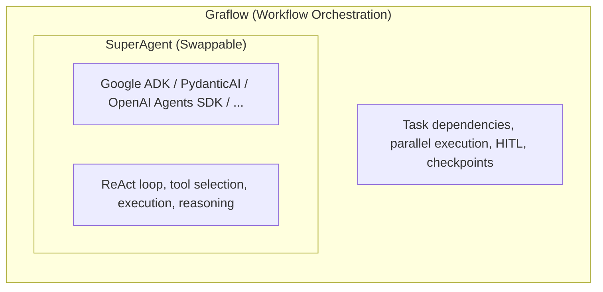

Comparing LangGraph and Graflow on LLM integration, observability/tracing, and building real workflows — from a data analysis pipeline to a task management agent.

<!-- truncate -->

This is Part 3 of our three-part comparison series. [Part 1](/blog/langgraph-vs-graflow-part1) covered design philosophy and core workflow features. [Part 2](/blog/langgraph-vs-graflow-part2) covered production features like HITL, checkpointing, and distributed execution.

---

## 10. LLM Integration — Framework Independence

### LangGraph: Tied to the LangChain Ecosystem

```python
from langchain_openai import ChatOpenAI
from langgraph.graph import MessagesState, StateGraph
from langchain_core.messages import HumanMessage, SystemMessage

llm = ChatOpenAI(model="gpt-4o-mini")

def call_llm(state: MessagesState) -> dict:
    system = SystemMessage(content="You are a helpful assistant")
    response = llm.invoke([system] + state["messages"])
    return {"messages": [response]}

graph = StateGraph(MessagesState)
graph.add_node("llm", call_llm)
graph.add_edge(START, "llm")
chatbot = graph.compile()
```

LangGraph is built on the LangChain ecosystem — `MessagesState`, `ChatOpenAI`, `ToolNode`, `create_react_agent`, and so on. Agent construction uses `create_react_agent` and `ToolNode`, which express tool call decisions and execution as workflow graph nodes and edges. This means **tool selection logic — which should be internal to the agent — leaks into the graph definition**, making workflows harder to follow.

### Graflow: Two Modes of Provider-Independent LLM Access

Graflow cleanly separates **workflow orchestration** from **agent tool calling**. Tool selection and execution are the agent's (SuperAgent's) responsibility; the workflow focuses on task flow control. This separation enables two LLM integration modes while remaining **independent of any specific LLM framework**.

**Mode 1: `inject_llm_client` — Simple LLM Calls**

For straightforward prompt-based tasks that don't need a ReAct loop:

```python
from graflow.llm.client import LLMClient

context.register_llm_client(LLMClient())

@task(inject_llm_client=True)
def summarize(llm: LLMClient, text: str) -> str:
    # LiteLLM integration: unified API across OpenAI/Claude/Gemini/etc.
    return llm.completion_text(
        [{"role": "user", "content": f"Summarize: {text}"}],
        model="gpt-4o-mini"
    )

@task(inject_llm_client=True, inject_context=True)
def multi_model_task(llm: LLMClient, context: TaskExecutionContext):
    # Switch models within a single task
    summary = llm.completion_text(messages, model="gpt-4o-mini")        # low-cost
    analysis = llm.completion_text(messages, model="claude-sonnet-4-20250514")  # high-quality
```

Thanks to [LiteLLM](https://docs.litellm.ai/) integration, you can call OpenAI, Anthropic Claude, Google Gemini, AWS Bedrock, Azure OpenAI, and local models via Ollama — all through a unified API. Switching providers means changing one string parameter, not swapping packages.

**Mode 2: `inject_llm_agent` — SuperAgent Dependency Injection**

For complex reasoning tasks that need tool calling and multi-turn interaction:

```python
from google.adk.agents import LlmAgent
from graflow.llm.agents.adk_agent import AdkLLMAgent

# Use Google ADK agent directly
adk_agent = LlmAgent(
    name="supervisor",
    model="gemini-2.5-flash",
    tools=[search_tool, calculator_tool],
    sub_agents=[analyst_agent, writer_agent]
)
agent = AdkLLMAgent(adk_agent)
context.register_llm_agent("supervisor", agent)

@task(inject_llm_agent="supervisor")
def research(agent, query: str) -> str:
    result = agent.run(query)
    return result["output"]
```

**PydanticAI example — Type-safe structured output:**

```python
from pydantic import BaseModel
from pydantic_ai import Agent
from graflow.llm.agents import PydanticLLMAgent

# Define structured output schema
class AnalysisResult(BaseModel):
    sentiment: str
    confidence: float
    key_points: list[str]

# Create Pydantic AI agent with structured output
pydantic_agent = Agent(
    model="openai:gpt-4o",
    output_type=AnalysisResult,
    system_prompt="You are a data analyst.",
)

@pydantic_agent.tool
def search_data(ctx, query: str) -> dict:
    return {"results": ["result1", "result2"]}

agent = PydanticLLMAgent(pydantic_agent, name="analyzer")
context.register_llm_agent("analyzer", agent)

@task(inject_llm_agent="analyzer")
def analyze(agent, text: str) -> dict:
    result = agent.run(text)
    output: AnalysisResult = result["output"]  # Type-safe!
    return output.model_dump()
```

Both ADK and PydanticAI agents are registered and used through the **same `inject_llm_agent` interface** — the workflow code doesn't need to know which framework is behind the agent.

### SuperAgent as a Fat Node — Separation of Concerns

This is a fundamental design difference between the two frameworks.

**LangGraph takes a full-stack approach**: it implements both the SuperAgent (ReAct loop, tool execution) and the workflow orchestration within the same graph. `create_react_agent` builds the agent → tools → agent loop as graph nodes and edges.

**Graflow takes a separation-of-concerns approach**: SuperAgent functionality (ReAct loops, tool selection, execution) is **delegated to specialized frameworks** — Google ADK, PydanticAI, OpenAI Agents SDK, [Strands Agents](https://github.com/strands-agents/sdk-python), and others. Graflow wraps them as "fat nodes" and focuses purely on workflow orchestration.



Why does this matter?

- **Best-of-breed**: Use Google ADK for its context compression and sub-agent capabilities, PydanticAI for type-safe tool definitions, or OpenAI Agents SDK for its handoff patterns — all within the same workflow.
- **Swap without rewiring**: Changing from ADK to PydanticAI doesn't touch your workflow code. Only the agent registration changes.
- **Cleaner graphs**: Workflow graphs express business logic flow, not internal agent reasoning loops.

| | LangGraph | Graflow |
|---|---|---|
| **Strategy** | Full-stack | Separation of concerns |
| **SuperAgent** | Built-in (`create_react_agent`) | Delegated (ADK, PydanticAI, etc.) |
| **LLM calls** | Via LangChain (`ChatOpenAI`, etc.) | Via LiteLLM (provider-independent) |
| **Multi-model** | Requires node splitting for model changes | Switch with `model=` param within a task |

### Standalone SDKs vs. Orchestration Frameworks

You might wonder: why not just use a standalone agent SDK (like ADK or OpenAI Agents SDK) without any orchestration framework? For simple PoCs or prototypes, this works well.

However, production requirements — **loops and retries, checkpoint/resume, Human-in-the-Loop, error handling policies, multi-provider LLM management, prompt versioning** — quickly add up. You end up building orchestration framework features from scratch, and the development and maintenance cost is non-trivial.

Graflow provides these features out of the box while leaving agent SDK choice entirely up to you. "Graflow for orchestration, your preferred SDK for agent reasoning" — this separation of concerns avoids reinventing the wheel while keeping your stack flexible.

---

## 11. Tracing and Observability

### LangGraph: LangSmith (Paid SaaS)

```python
import os
os.environ["LANGCHAIN_TRACING_V2"] = "true"
os.environ["LANGCHAIN_API_KEY"] = "ls-xxxxxxxx"
```

LangGraph integrates with [LangSmith](https://smith.langchain.com/), LangChain's paid SaaS. Setting environment variables enables automatic tracing of node execution times, I/O data, token usage, and errors. The simplicity is appealing, but LangSmith is **closed-source with no self-hosting option**. There's a free tier, but production use requires a paid plan.

### Graflow: Langfuse (OSS) + OpenTelemetry

Graflow uses [Langfuse](https://langfuse.com/), an open-source observability platform that provides tracing, evaluation, and prompt management — equivalent to LangSmith but **completely free when self-hosted**.

**Setup:**

```bash
# Step 1: Start Langfuse server (local dev)
docker run -p 3000:3000 langfuse/langfuse

# Step 2: Set environment variables
export LANGFUSE_PUBLIC_KEY=pk-lf-xxxxxxxx
export LANGFUSE_SECRET_KEY=sk-lf-xxxxxxxx
export LANGFUSE_HOST=http://localhost:3000
```

```python
# Step 3: Add tracer to your workflow (3 lines)
from graflow.trace.langfuse import LangFuseTracer

tracer = LangFuseTracer(enable_runtime_graph=True)

with workflow("my_workflow", tracer=tracer) as wf:
    search >> analyze >> report
    wf.execute("search")
```

**OpenTelemetry context propagation** means that LLM calls within tasks (via LiteLLM or Google ADK) are **automatically attached as child spans** of the workflow trace:

```python
@task(inject_llm_client=True, inject_context=True)
def analyze(llm: LLMClient, context: TaskExecutionContext):
    # This LLM call is automatically recorded under the "analyze" task span
    result = llm.completion_text(
        [{"role": "user", "content": "Analyze this data"}],
        model="gpt-4o-mini"
    )
    return result
```

In distributed worker environments, trace IDs propagate automatically — tasks running across multiple workers appear as **a single unified trace**.

| Aspect | LangSmith (LangGraph) | Langfuse (Graflow) |
|---|---|---|
| **License** | Closed-source (SaaS) | OSS (MIT License) |
| **Self-hosting** | Not available | Docker / ECS / Kubernetes |
| **Cost** | Paid plan required (production) | Free when self-hosted |
| **LLM coverage** | LangChain calls only | All LiteLLM-supported providers |
| **Context propagation** | LangChain proprietary | OpenTelemetry standard |
| **Distributed traces** | Not supported | Automatic trace ID propagation |

---

## 12. Hands-On: Data Analysis Pipeline

Let's combine the features we've discussed into a practical pipeline.

**Goal**: Fetch data → analyze in parallel → generate report

```python
from graflow.core.context import TaskExecutionContext
from graflow.core.decorators import task
from graflow.core.workflow import workflow

with workflow("data_analysis") as ctx:

    @task(inject_context=True)
    def fetch_data(context: TaskExecutionContext):
        """Fetch data and store in channel"""
        data = {
            "sales": [100, 200, 150, 300, 250],
            "costs": [50, 80, 60, 120, 100],
        }
        channel = context.get_channel()
        channel.set("raw_data", data)
        print(f"Fetched: {len(data['sales'])} records")

    @task(inject_context=True)
    def analyze_sales(context: TaskExecutionContext):
        """Sales analysis (parallel task 1)"""
        channel = context.get_channel()
        sales = channel.get("raw_data")["sales"]
        total = sum(sales)
        channel.set("sales_total", total)
        print(f"Sales analysis: total={total}, avg={total/len(sales)}")

    @task(inject_context=True)
    def analyze_costs(context: TaskExecutionContext):
        """Cost analysis (parallel task 2)"""
        channel = context.get_channel()
        costs = channel.get("raw_data")["costs"]
        total = sum(costs)
        channel.set("cost_total", total)
        print(f"Cost analysis: total={total}, avg={total/len(costs)}")

    @task
    def generate_report(sales_total: int, cost_total: int):
        """Merge results into report (auto keyword argument resolution)"""
        profit = sales_total - cost_total
        margin = (profit / sales_total) * 100
        print(f"\n=== Analysis Report ===")
        print(f"  Total sales: {sales_total}")
        print(f"  Total costs: {cost_total}")
        print(f"  Profit: {profit} (margin: {margin:.1f}%)")

    # Workflow definition — one line tells the whole story
    fetch_data >> (analyze_sales | analyze_costs) >> generate_report

    ctx.execute("fetch_data")
```

**Output:**
```
Fetched: 5 records
Sales analysis: total=1000, avg=200.0
Cost analysis: total=410, avg=82.0

=== Analysis Report ===
  Total sales: 1000
  Total costs: 410
  Profit: 590 (margin: 59.0%)
```

This compact example demonstrates:
- `@task` decorator with `>>` / `|` operators
- Channel-based inter-task data sharing
- **Auto keyword argument resolution** (`generate_report`'s parameters are automatically injected from channel keys)
- Diamond pattern (Fan-out → Fan-in)

---

## 13. Hands-On: Task Management Agent

Let's build a more complex example — a task management agent with HITL — and compare the design approaches.

### LangGraph: StateGraph + ToolNode + conditional_edges

```python
# LangGraph: State + ToolNode + conditional_edges
class AgentState(TypedDict):
    messages: Annotated[list, add_messages]
    tasks: list[dict]

graph = StateGraph(AgentState)
graph.add_node("agent", call_model)      # LLM decides tool calls
graph.add_node("tools", ToolNode(tools)) # Auto-dispatch tools
graph.add_conditional_edges("agent", should_use_tools,
    {"tools": "tools", "end": END})
graph.add_edge("tools", "agent")         # Loop back after tool execution

# HITL: interrupt on important task deletion
def delete_task(task_id: str):
    if task["important"]:
        approval = interrupt({"message": "Delete important task?"})
        if approval != "yes":
            return "Deletion cancelled"
```

LangGraph requires combining `StateGraph` + `ToolNode` + `conditional_edges` + `interrupt` — multiple specialized APIs working together. The ReAct loop (agent → tools → agent) is expressed as graph nodes and edges.

### Graflow: ADK SuperAgent + request_feedback

Graflow delegates the ReAct loop entirely to Google ADK and focuses the workflow on business logic:

```python
from google.adk.agents import LlmAgent
from graflow.core.context import ExecutionContext, TaskExecutionContext
from graflow.core.decorators import task
from graflow.core.workflow import workflow
from graflow.llm.agents.adk_agent import AdkLLMAgent
from graflow.llm.agents.base import LLMAgent

# Task store (use a DB in production)
task_store: list[dict] = []

# --- Tool definitions (plain Python functions) ---

def add_task(title: str, important: bool = False) -> str:
    """Create a new task."""
    entry = {"id": len(task_store) + 1, "title": title,
             "important": important, "done": False}
    task_store.append(entry)
    return f"Added task '{title}' (ID: {entry['id']})"

def list_tasks() -> str:
    """List all tasks."""
    if not task_store:
        return "No tasks"
    return "\n".join(
        f"{'[x]' if t['done'] else '[ ]'} [{t['id']}] {t['title']}"
        + (" *" if t["important"] else "")
        for t in task_store
    )

def delete_task(task_id: int) -> str:
    """Delete a task. Important tasks require approval."""
    for t in task_store:
        if t["id"] == task_id:
            task_store.remove(t)
            return f"Deleted task '{t['title']}'"
    return f"Task ID {task_id} not found"

# --- Workflow ---

with workflow("task_agent") as ctx:

    # Register ADK agent (factory pattern)
    def create_agent(exec_context: ExecutionContext) -> AdkLLMAgent:
        adk_agent = LlmAgent(
            name="task_manager",
            model="gemini-2.5-flash",
            instruction="You are a task management assistant. Use the appropriate tools.",
            tools=[add_task, list_tasks, delete_task],
        )
        return AdkLLMAgent(adk_agent, app_name=exec_context.session_id)

    ctx.register_llm_agent("task_manager", create_agent)

    @task(inject_llm_agent="task_manager", inject_context=True)
    def handle_request(llm_agent: LLMAgent, context: TaskExecutionContext):
        """ADK agent handles tool selection, execution, and response"""
        result = llm_agent.run("Add 'Write report' as an important task")
        print(f"Agent: {result['output']}")

    @task(inject_context=True)
    def confirm_deletion(context: TaskExecutionContext):
        """HITL approval for important task deletion"""
        channel = context.get_channel()
        pending = channel.get("pending_delete")
        if not pending:
            return

        response = context.request_feedback(
            feedback_type="approval",
            prompt=f"Delete important task '{pending['title']}'?",
            timeout=60,
        )
        if response.approved:
            delete_task(pending["id"])
            print("Deletion approved")
        else:
            print("Deletion cancelled")

    handle_request >> confirm_deletion
    ctx.execute("handle_request")
```

**Swapping to PydanticAI — only the agent registration changes:**

```python
from pydantic_ai import Agent
from graflow.llm.agents import PydanticLLMAgent

with workflow("task_agent") as ctx:

    # Same tools, different agent framework
    pydantic_agent = Agent(
        model="openai:gpt-4o",
        system_prompt="You are a task management assistant. Use the appropriate tools.",
    )

    # Register tools via @agent.tool decorator
    @pydantic_agent.tool
    def add_task_tool(ctx, title: str, important: bool = False) -> str:
        """Create a new task."""
        entry = {"id": len(task_store) + 1, "title": title,
                 "important": important, "done": False}
        task_store.append(entry)
        return f"Added task '{title}' (ID: {entry['id']})"

    @pydantic_agent.tool
    def list_tasks_tool(ctx) -> str:
        """List all tasks."""
        if not task_store:
            return "No tasks"
        return "\n".join(
            f"{'[x]' if t['done'] else '[ ]'} [{t['id']}] {t['title']}"
            + (" *" if t["important"] else "")
            for t in task_store
        )

    agent = PydanticLLMAgent(pydantic_agent, name="task_manager")
    ctx.register_llm_agent("task_manager", agent)

    # The workflow tasks remain EXACTLY the same
    @task(inject_llm_agent="task_manager", inject_context=True)
    def handle_request(llm_agent: LLMAgent, context: TaskExecutionContext):
        """Agent handles tool selection, execution, and response"""
        result = llm_agent.run("Add 'Write report' as an important task")
        print(f"Agent: {result['output']}")

    @task(inject_context=True)
    def confirm_deletion(context: TaskExecutionContext):
        """HITL approval — identical to ADK version"""
        # ... (same as above)

    handle_request >> confirm_deletion
    ctx.execute("handle_request")
```

The key point: **only the agent setup changes** — tool registration moves from plain functions to `@agent.tool` decorators, and `AdkLLMAgent` becomes `PydanticLLMAgent`. The workflow tasks (`handle_request`, `confirm_deletion`) and their wiring remain identical.

### Design Philosophy Comparison

| Aspect | LangGraph | Graflow |
|---|---|---|
| **Tool definitions** | `@tool` decorator (LangChain-dependent) | Plain functions (ADK) / `@agent.tool` (PydanticAI) |
| **ReAct loop** | `agent`→`tools`→`agent` built as graph nodes | Delegated to agent framework (`llm_agent.run()` — one line) |
| **Tool dispatch** | `ToolNode` auto-dispatch | ADK / PydanticAI auto-dispatch |
| **HITL** | `interrupt()` → `Command(resume=)` | `request_feedback()` (regular function call) |
| **State management** | `AgentState` (TypedDict + Reducer) | Channel `set`/`get` |
| **LLM choice** | `ChatOpenAI` etc. (LangChain-dependent) | ADK (Gemini) / LiteLLM (all providers) |

Key takeaways from the Graflow approach:

- **No ReAct loop in the graph**: LangGraph requires `agent` → `tools` → `agent` with multiple nodes and conditional edges. Graflow's `llm_agent.run()` completes the ReAct loop in **one line**. The workflow graph focuses on business logic flow.
- **HITL as a workflow concern**: Instead of calling `interrupt()` inside a tool, approval is a **separate workflow task**. This separation of concerns makes testing and flow changes easier.
- **Swappable agents**: Replace ADK with PydanticAI or another framework — the workflow structure stays the same.

---

## Summary

### Comparison Table

| Aspect | LangGraph | Graflow |
|---|---|---|
| **Graph definition** | `add_node` + `add_edge` + `compile` | `>>` / `\|` operators (one-line structure) |
| **Data sharing** | State (TypedDict + Reducer) | Channel (Key-Value) + auto keyword resolution |
| **Branching** | `add_conditional_edges` (pre-defined) | `next_task()` / `next_iteration()` (runtime dynamic) |
| **HITL** | `interrupt` + `Command(resume=)` | `request_feedback()` + auto-checkpoint on timeout |
| **Checkpointing** | Automatic only | User-controlled (save when it matters) |
| **Parallel error control** | None | 4 built-in policies + custom |
| **Distributed execution** | None (in-process threading only) | Redis-based workers for horizontal scaling (OSS) |
| **Task handlers** | In-process only | direct / docker / custom |
| **LLM integration** | LangChain ecosystem required | LiteLLM + any SuperAgent framework |
| **Tracing** | LangSmith (paid SaaS) | Langfuse (OSS) + OpenTelemetry (self-hostable, free) |
| **Execution model** | Define-and-Run (frozen after compile) | Define-by-Run (graph built during execution) |
| **Design philosophy** | Full-stack (SuperAgent + Workflow) | Separation of concerns (Workflow-focused, SuperAgent delegated) |

### When to Use Which

**Graflow shines when you need:**
- Intuitive, concise workflow definitions
- Runtime dynamic task generation and branching
- Checkpoint/resume for long-running workflows
- Distributed execution within an OSS stack
- Freedom to choose your LLM framework

**LangGraph works well when:**
- Your flow is fixed and rarely changes
- Static graph visualization and validation are priorities
- You're already invested in the LangChain ecosystem (LangSmith, etc.)

### Graflow's Five Core Values

| # | Core Value | Description |
|---|---|---|
| 1 | **Strategic simplicity** | Delegate SuperAgent (ReAct, etc.) to specialized frameworks (ADK, PydanticAI); focus on workflow orchestration |
| 2 | **Runtime flexibility** | Dynamic task generation via `next_task()`, loop control via `next_iteration()`, early termination via `terminate/cancel_workflow()` |
| 3 | **Developer experience** | Pythonic operator DSL (`>>`, `\|`) for intuitive workflow definition |
| 4 | **Production readiness** | Checkpoint/resume, HITL, Docker task handlers |
| 5 | **Scalable parallel execution** | Airflow-style horizontal scaling; local → distributed in one line |

---

Issues and PRs are welcome on [GitHub](https://github.com/GraflowAI/graflow). Follow [@GraflowAI](https://x.com/GraflowAI) on X for updates.
