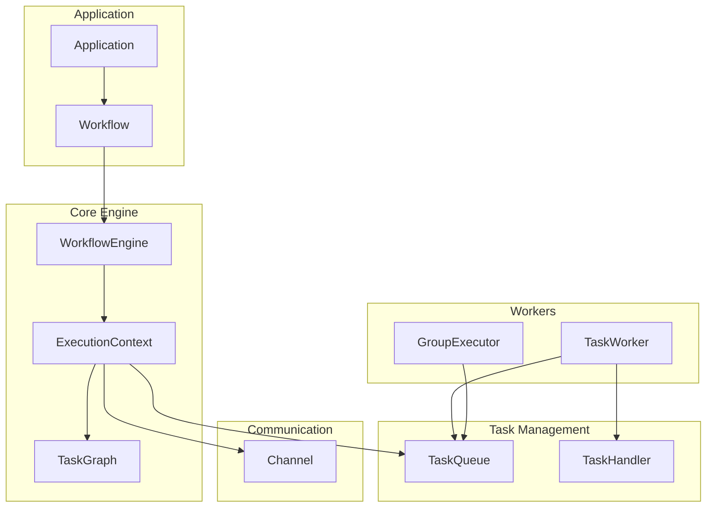

# Architecture Overview

Graflow is a Python framework for distributed task execution and workflow management.

## Design Philosophy

1. **Single Execution Engine**: All execution paths use `WorkflowEngine.execute(context, start_task_id)`
2. **Peer-to-Peer Architecture**: No Master/Slave relationships
3. **Transparent State Sharing**: Channel-based abstraction for local/distributed
4. **Automatic Dependency Resolution**: Graph-based successor processing

## System Architecture



## Core Components

| Component | Role |
|-----------|------|
| **WorkflowEngine** | Central execution engine with unified task execution loop |
| **ExecutionContext** | State container: task queue, completed tasks, results, control flags |
| **TaskGraph** | DAG structure holding task dependencies |
| **TaskQueue** | Abstract queue (Memory / Redis implementations) |
| **Channel** | Inter-task communication (Memory / Redis implementations) |
| **TaskHandler** | Task execution handler |
| **GroupExecutor** | BSP-based parallel group execution |

## State Machine Execution

Tasks transition through three states:

```
PENDING → EXECUTING → COMPLETED
   ↑                      │
   └──── Queue successors ┘
```

### Control Flow Priority

| Priority | Control | Task Completed | Exception |
|----------|---------|----------------|-----------|
| 1 | `cancel_workflow()` | No | Yes |
| 2 | `terminate_workflow()` | Yes | No |
| 3 | `goto` (via `next_task`) | Yes | No |
| 4 | Normal flow | Yes | No |

## Dynamic Flow Control

```python
# Dynamic task generation
ctx.next_task(new_task)            # Add task, process successors
ctx.next_task(new_task, goto=True) # Add task, skip successors
ctx.next_task(existing_task)       # Jump to existing (auto-goto)

# Iteration
ctx.next_iteration(data)           # Re-execute with data

# Workflow control
ctx.terminate_workflow("message")  # Normal exit
ctx.cancel_workflow("message")     # Abnormal exit
```

## BSP Parallel Execution

ParallelGroup uses the BSP (Bulk Synchronous Parallel) model:

| Phase | Description |
|-------|-------------|
| Computation | Tasks execute in parallel |
| Communication | Results shared via Channel |
| Barrier | Wait for all tasks to complete |

## Configuration

**In-Memory (Local)**:
```python
context = ExecutionContext.create(
    graph=task_graph,
    start_node="start",
    channel_backend="memory"
)
```

**Redis (Distributed)**: See [Task Workers](./task-workers.md)

## Scalability & Reliability

| Aspect | Approach |
|--------|----------|
| **Horizontal scaling** | Multiple stateless workers via Redis |
| **Retry** | Configurable at TaskSpec level with exponential backoff |
| **Checkpoints** | Save/restore execution state |
| **Graceful shutdown** | Signal handling with active task completion |

For distributed execution details, see [Task Workers](./task-workers.md).
